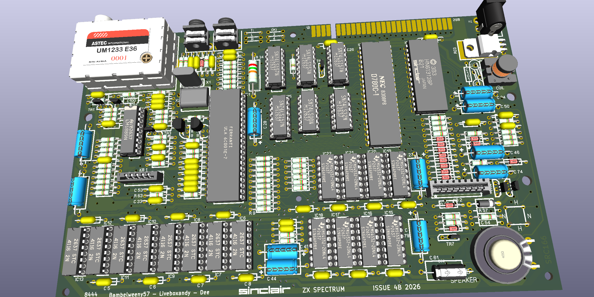
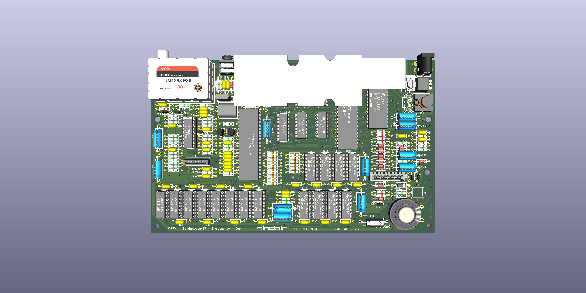

This is a Kicad 10 project and was only used to create an ibom to assist in the debugging of faulty boards. Use at your own risk.

The ZX Spectrum Issue 4B PCB used has an MFG date of 8444 and has a silkscreen FAB revision of SRC168, a topside FAB revision of SRC166 and a solder side FAB revision of SRC167.

The created schematic was based on the physical layout of the PCB and appears to show the DCDC circuit as per a revision 4A where capacitor C79 is before R79 and D19 is after R79 on the -5V line.

Note that R32 is fitted as a 0R link on this PCB.

According to the Issue 6 schematic, C100 is 10nF and C101 is 47nF.

I would not use these gerbers to manufacture a PCB without a lot more checking.

Have fun.